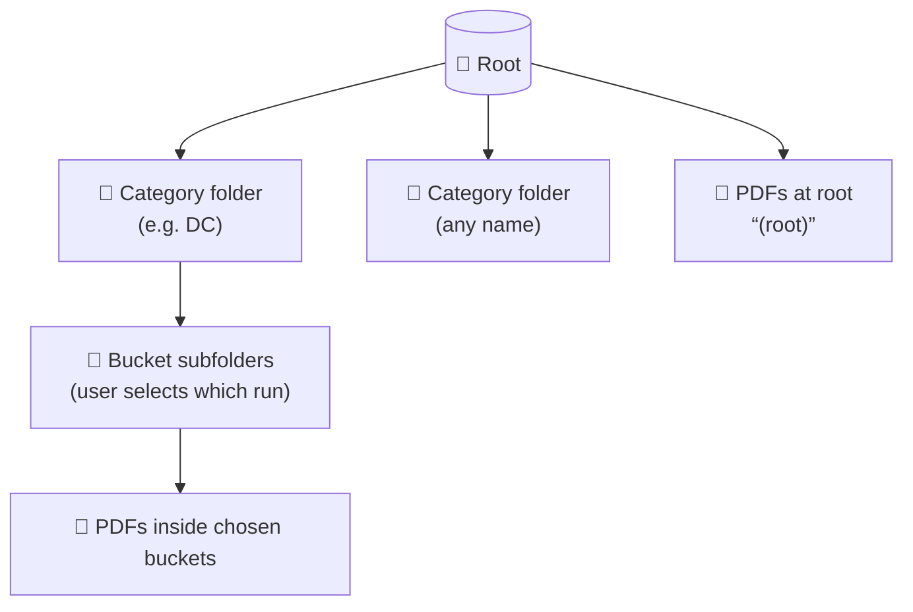

# LeadfFlow AI Parser

## Quickstart (about 1 minute)
1. Create and activate a virtual environment:
   - `python -m venv .venv`
   - **macOS / Linux:** `source .venv/bin/activate`
   - **Windows (cmd):** `.venv\Scripts\activate.bat`
   - **Windows (PowerShell):** `.venv\Scripts\Activate.ps1`
2. Install dependencies:
   - `pip install -r requirements.txt`
3. Configure environment (optional): create a `.env` in the repo root if you use env-based secrets (e.g. `OPENAI_API_KEY`); see `app/core/config.py` for supported variables.
4. Start the dev server:
   - `uvicorn app.main:app --reload --host 0.0.0.0 --port 8000`
5. Open in your browser:
   - `http://localhost:8000/`
   - Health check (liveness): `http://localhost:8000/health` or `http://localhost:8000/health/`

## Requirements

- **Python 3.12+** (see `requirements.txt`).
- **Java (JRE/JDK)** on the server if you run DC PDF text extraction: Apache Tika is used via the `tika` package and shells out to Java. Ensure `java` is on `PATH`.
  - **Windows (download JDK):** download an OpenJDK build from **Adoptium (Temurin) JDK 17 (LTS)**:
    - Go to https://adoptium.net/temurin/releases/
    - Choose: `17` (LTS), `JDK`, `Windows`, and `x64`
    - Download the `.msi` installer and install it
    - After installation, verify in a new terminal: `java -version`
    - If `java` is not found, add Java to `PATH`:
      - Find your install folder (commonly something like `C:\Program Files\Eclipse Adoptium\jdk-17.*\`)
      - Add `<JAVA_HOME>\bin` (or the `bin` directory) to `PATH`

## Folder Selection Flow
- **Browser:** the UI uses a folder picker (`webkitdirectory`), discovers **categories** (immediate children of the picked root) and **buckets** (immediate subfolders under each category), and lets you choose which buckets to run. Client-side grouping is for display and building **`selection`** only; the server routes each PDF to a parser using the **category label from `selection`** (or legacy fallbacks below), not by re-inferring from path shape alone for the browser flow.
- **Upload to server:** the UI uploads PDFs via `POST /api/upload-folder` and receives an `upload_job_id`. Staged files live under `outputs/uploads/<upload_job_id>/`.
- **Process:** `POST /api/process-batch` sends `root_folder` + `upload_job_id` + **`selection`**: `[{ "category", "subfolders" }, …]` where `subfolders` includes `""` when PDFs sit directly in the category folder. Optional **legacy:** `pdf_paths` with `upload_job_id` (no `selection`) for scripts/tests; or `pdf_paths` on the server host without an upload job.
- Vocabulary and examples: `app/core/batch_selection_contract.py`, migration notes: [`todo.md`](todo.md).

## Expected folder layout

Pick one folder in the browser — that folder is the **root**. The **immediate children of the root** are **category folders** (any names, e.g. `DC`, `VA Alexandria`). Under each category folder, **immediate subfolders** are **buckets**; tick the buckets (or “direct” PDFs) you want, then **Process** sends that as **`selection`** (see `app/core/batch_selection_contract.py` and [`todo.md`](todo.md)).

**Tree view** (categories = first level under root; buckets = next level):

```text
📂 YourRoot   ← you select this in the folder picker
│
├── 📂 DC                     ← category folder
│   ├── 📂 2026   ← bucket (user will tick/untick these)
│   │   └── 📄 case.pdf
│   └── 📂 2025
│       └── 📄 other.pdf
│
├── 📂 VA Alexandria           ← another category folder
│   └── 📂 Circuit
│       └── 📄 doc.pdf
│
└── 📄 overview.pdf            ← at root only → “(root)”, not under a category
```

**Flow view:**



- **Parsers:** for the upload + **`selection`** flow, each staged file is tied to the **client’s category string** from `selection`; `resolve_parser_key_for_user_category_folder` maps that name to an implementation. Unmapped categories return **400** with a clear message before a job starts. Registry: `app/core/supported_pdf_categories.py`.

## Prompt Versions
- Versioned prompts are stored flat under `prompts/`.
- Runtime picks prompt version from `config.json` key `dc_prompt_version` and loads `prompts/<version>.txt`.

## Running in Development

Same `uvicorn` command as Quickstart. Use a project venv so `tika` and Java match the environment where you run batch jobs.

Optional: verify the AI service is reachable:
- `python scripts/test_ai_service.py`
- `python scripts/test_ai_service.py --model gpt-5.1-2025-11-13`

## Logging (`logs-dir/`)

## Troubleshooting

## Architecture Overview

- **Batch vocabulary & target API:** `app/core/batch_selection_contract.py`; migration checklist: `todo.md`.
- **Parser implementations** (internal keys like `dc`, not “allowed folder names”): `app/core/supported_pdf_categories.py`.


## Roadmap

